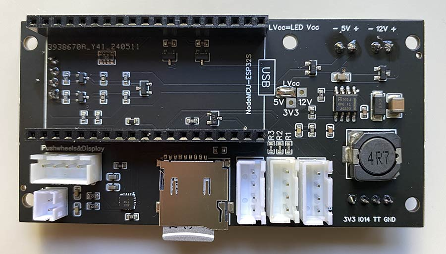
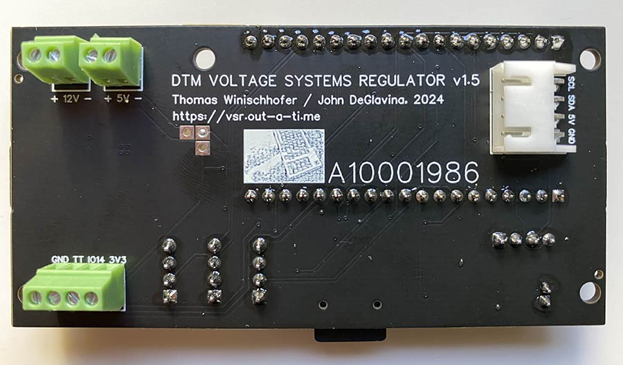
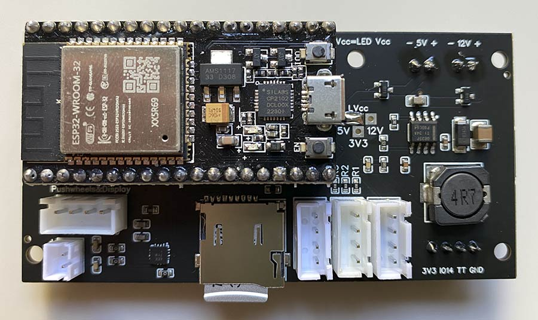

## VSR Control Board

To have [JCLPCB](https://jlcpcb.com) make your Control Board:
1) Create an account at jlcpcb.com
2) Click "Upload Gerber file" or "order now"
3) Upload the Gerber file (.zip, do not decompress!) for the PCB you want to make; leave all options at their defaults. You can choose a PCB color though...
4) Activate "PCB assembly", click "NEXT"
5) Enjoy a view of the PCB, click "NEXT"
6) Upload the BOM and "PickAndPlace" (CPL) files, click "Process BOM & CPL"
7) Read the remarks regarding the BOM below
8) Enjoy a nice 2D or 3D view of your future board, click "NEXT". (If the display stalls at "Processing files", click "NEXT" regardless).
9) Select a "product description" (eg. "Movie prop") and click "Save to cart". Then finalize your order.

#### Remarks on BOM (Bill of Materials):

1) "ESP32" is the required ESP32 dev board (NodeMCU ESP32S) and it is intentionally missing in the BOM. The ESP32 dev board should not be soldered to the PCB directly; use 1x19P female pin headers (LCSC part number C7509529) (pitch 2.54mm). When JLCPCB complains about a "missing data" after processing the BOM, click "Continue".
2) You need to place _either_ "L1" _or_ "L2", not both. These are two alternative components, and they share the same physical location. In the "Bill of Materials" tab, deselect L1 or L2.
3) When clicking "Next", JLCPCB will complain about "unselected parts". Click "Do not place".

#### You additionally need:
- 1x NodeMCU ESP32 devboard, preferably with CP2102 USB-to-UART converter. 19pin version. For example: [This one](https://www.waveshare.com/nodemcu-32s.htm)
- 2x 19pin femals headers, 8.5mm high, 2.54mm pitch (LCSC part number C7509529). If you can't get them for exactly 19 pins, get some longer ones and cut them.
- Screw terminals and XH connector on the back of the Control Board:
  - 2x DG308-2.54-02P-14-00A(H) (LCSC part number C699496) (or [any other](https://www.mouser.com/ProductDetail/Amphenol-Anytek/VN02A1500000G?qs=Mv7BduZupUgf8d3Xo6xdxw%3D%3D); 2.54mm pitch, 2 pins) for 5V and 12V connectors;
  - 1x DG308-2.54-04P-14-00A(H) (LCSC part number C708735) (or [any other](https://www.mouser.com/ProductDetail/Amphenol-Anytek/VN04A1500000G?qs=Mv7BduZupUg1gSttWAc7xA%3D%3D); 2.54mm pitch, 4 pins; optional: for time travel button);
  - 1x XH-4AWD connector (LCSC part number C8877); this is optional and only for connecting a temperature sensor.
- XH 4pin cables to connect the Control Board, the Pushwheels and the LED display
- [XH 4pin cables](https://www.mouser.com/ProductDetail/Adafruit/4874?qs=pBJMDPsKWf2xNVLRCKmIKQ%3D%3D) to connect the three buttons ("BUT"/"BUT" pins: shorted by button; "L+"/"L-" pins for light)
- the ability to solder through-the-hole parts, and the required tools.

The voltage for the lights inside the buttons can be selected from 3.3V, 5V, and 12V. There is a "T" shaped solder jumper on the Control Board. Connect "3V3" and "LVcc" for 3.3V, for instance. If you go for 12V, the Control Board must be powered with 12V through the respective connector on the back of the PCB. On the pictures above, 5V is selected.

_(If links to LCSC get you a 403 error, click into the URL field in your browser and press ENTER.)_

