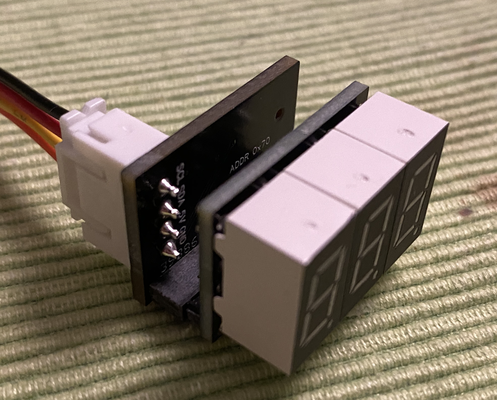

## VSR LED display

The LED display consists of two PCBs stacked on each other.

1) The tube carrier: Gerber_TC-0.36-1.0; there is no BOM, the only components are three single-digit 0.36" (9mm) LED segment displays, and the pin header/socket.
2) The i2c backpack: Gerber_I2CBP-0.36-1.0, BOM_I2CBP-0.36-1.0, PickAndPlace_I2CBP-0.36-1.0

The connection between the PCBs can be using a pin header/socket (11 pins, 2mm pitch), or soldered using a pin header long enough to keep a distance between the PCBs.

### Remark on BOM for i2c backpack:

