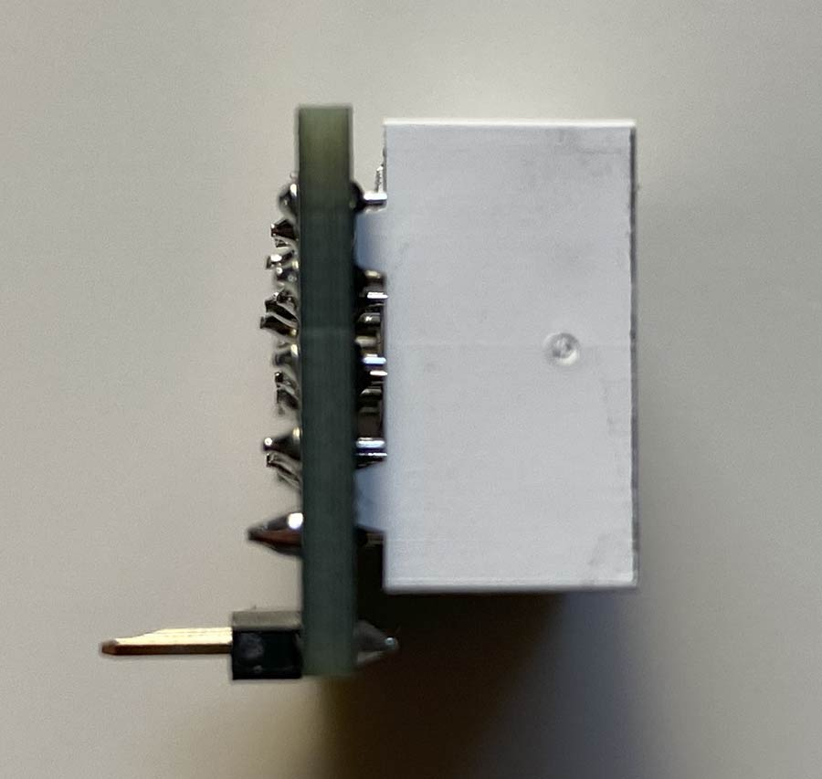

## VSR LED display

The LED display consists of two PCBs stacked on each other.

1) The tube carrier: Gerber_TC-0.36-1.0; there is no BOM, the only components are three single-digit 0.36" (9mm) LED segment displays, and the pin header/socket.

2) The i2c backpack: Gerber_I2CBP-0.36-1.0, BOM_I2CBP-0.36-1.0, PickAndPlace_I2CBP-0.36-1.0

The connection between the PCBs can be using a pin header/socket (11 pins, 2mm pitch), or soldered using a pin header long enough to keep a distance between the PCBs.

To have [JCLPCB](https://jlcpcb.com) make your LED display:
1) Create an account at jlcpcb.com
2) Click "Upload Gerber file" or "order now"
3) Upload the "Gerber_I2CBP" file (.zip, do not decompress!); leave all options at their defaults. You can choose a PCB color though...
4) Activate "PCB assembly", click "NEXT"
5) Enjoy a view of the PCB, click "NEXT"
6) Upload the BOM and "PickAndPlace" (CPL) files, click "Process BOM & CPL"
8) Enjoy a nice 2D or 3D view of your future board, click "NEXT". (If the display stalls at "Processing files", click "NEXT" regardless).
9) Select a "product description" (eg. "Movie prop") and click "Save to cart".
10) Click "Order now" (top right on screen) to add the Tube holder PCB
11) Upload the "Gerber_TC" file; select PCB color, leave all other options at their defaults
12) Do NOT activate "PCB assembly"; click on "Save to Cart"
13) Finialize your order

You additionally need:
- 3x 9mm/0.36" red single digit LED segment tubes (available on ebay)
- 1x 11pin 2mm pitch male pin header
- 1x [11pin 2mm pitch female pin header]([11](https://www.mouser.com/ProductDetail/NorComp/25631101RP2?qs=TaIhzdgpGpUc9hecPJ8SJg%3D%3D))
- the ability to solder through-the-hole parts, and the required tools.

