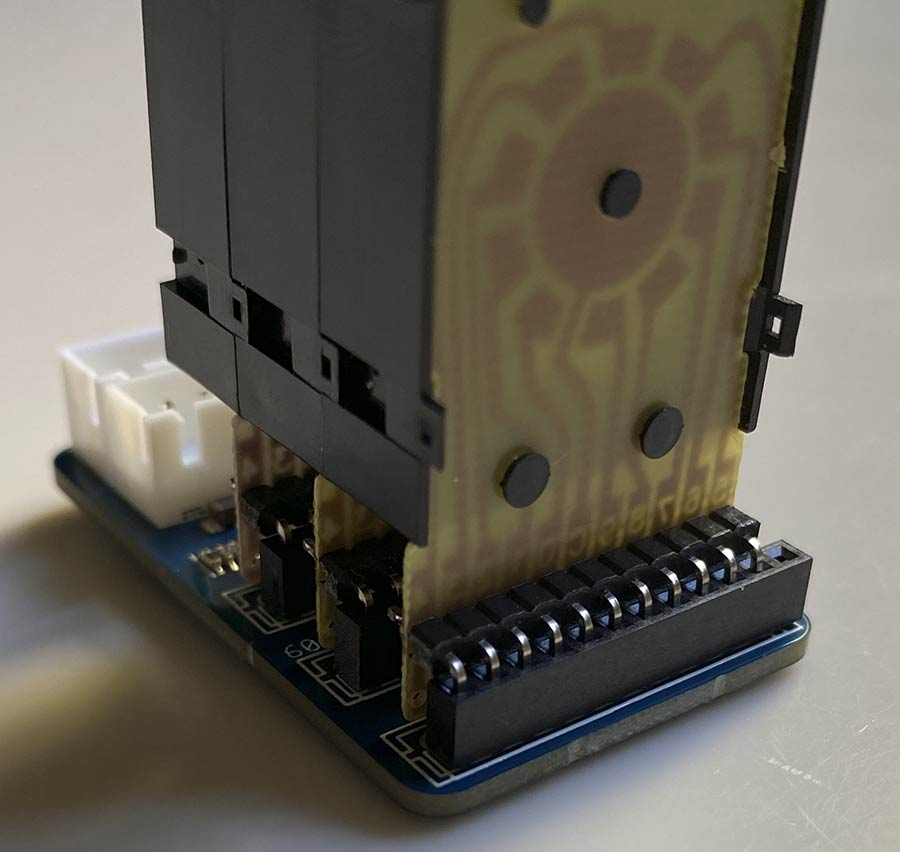
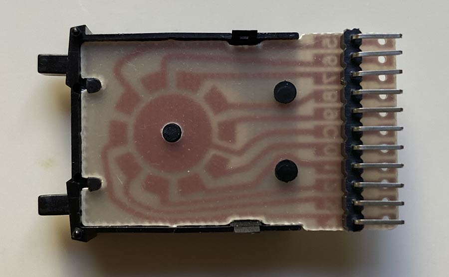
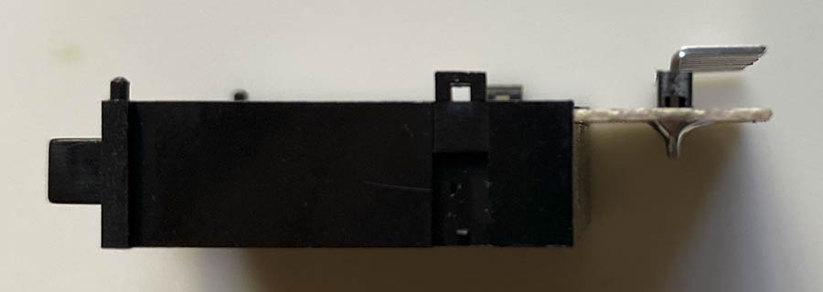
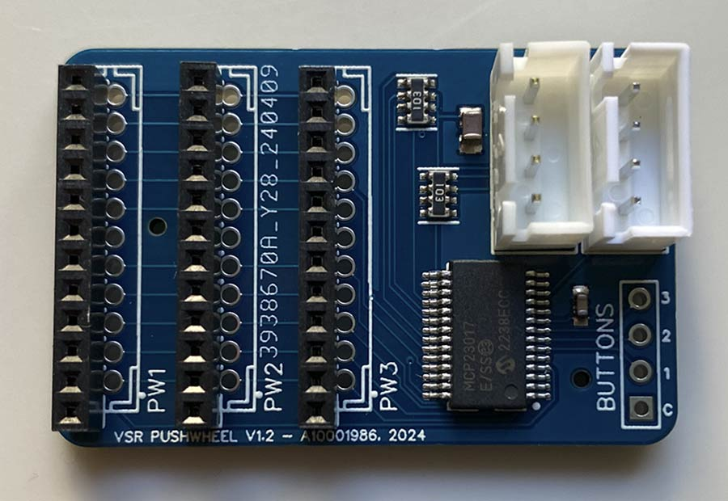

## The Pushwheel carrier PCB

The KM1 (22x8mm) pushwheels are attached through 2mm pitched pin sockets and 90 deg headers. On the PCB, there are two rows of solder pads; please use the left one with 12 pads (12 because 12-pin pin sockets are more easily available than 11-pin versions, and you don't have to make ugle cuts). The bottom hole is unassigned.

The two four-pin XH connectors are for connecting the LED display and the Control Board.

To have [JCLPCB](https://jlcpcb.com) make your Pushwheels Board:
1) Create an account at jlcpcb.com
2) Click "Upload Gerber file" or "order now"
3) Upload the Gerber file (.zip, do not decompress!) for the PCB you want to make; leave all options at their defaults. You can choose a PCB color though...
4) Activate "PCB assembly", click "NEXT"
5) Enjoy a view of the PCB, click "NEXT"
6) Upload the BOM and "PickAndPlace" (CPL) files, click "Process BOM & CPL"
7) After processing BOM & CPL, JLCPCB will complain about "missing data" for PW1-PW3. PW1-PW3 are 12-pin 2mm pitch pin sockets, and they can't be assembled by JLCPCB. Click "Continue".
8) Enjoy a nice 2D or 3D view of your future board, click "NEXT". (If the display stalls at "Processing files", click "NEXT" regardless).
9) Select a "product description" (eg. "Movie prop") and click "Save to cart". Then finalize your order.

#### You additionally need:
- 3x decimal KM1 pushwheels (22x8mm) (decimal, not BCD version; available on ebay and aliexpress; search terms: pushwheel thumbwheel KM1)
- 3x [1x11pin 2mm pitch 90 degrees male pin header](https://www.mouser.com/ProductDetail/Adam-Tech/2PH1R-11-UA?qs=HoCaDK9Nz5d0X2QsJeqJ4Q%3D%3D). You can buy those in any length >11, they easily break off. For example: [This](https://www.mouser.com/ProductDetail/Harwin/M22-2031205?qs=xxdqPuaJ%252Ba06lrlBpeOknw%3D%3D)
- 3x [1x11](https://www.mouser.com/ProductDetail/NorComp/25631101RP2?qs=TaIhzdgpGpUc9hecPJ8SJg%3D%3D) or [1x12 pin 2mm pitch female](https://www.mouser.com/ProductDetail/Harwin/M22-7131242?qs=%252Bk6%2F5FB6qrmdMF9FvJ5n1g%3D%3D) pin headers; solder them to left pad row (12 holes); if 11 pin header is used, align to top, leave bottom hole empty.
- the ability to solder through-the-hole parts, and the required tools.

