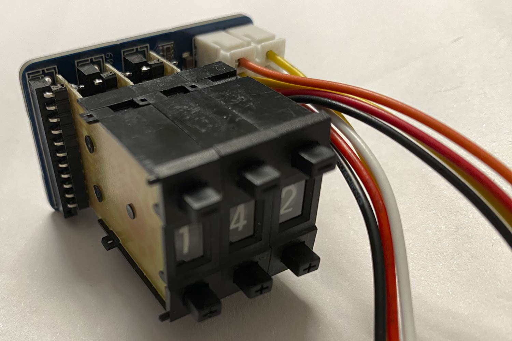
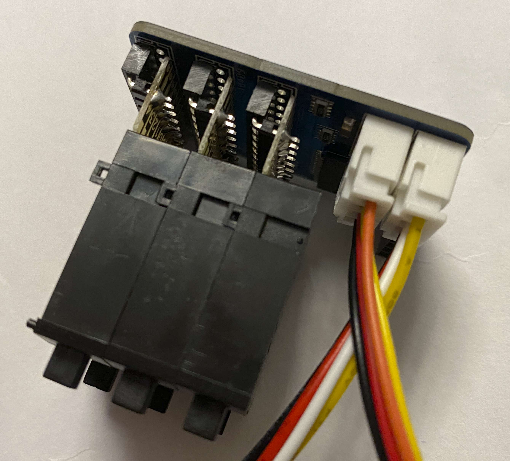

The Pushwheel carrier PCB

The KM1 (22x8mm) pushwheels can be attached by using 2mm pitched pin sockets and 90 deg headers. There are two rows of solder pads; for the pin sockets, use the left one with 12 pads (12 because 12-pin pin sockets are more easily available than 11-pin versions, and you don't have to make ugle cuts)

