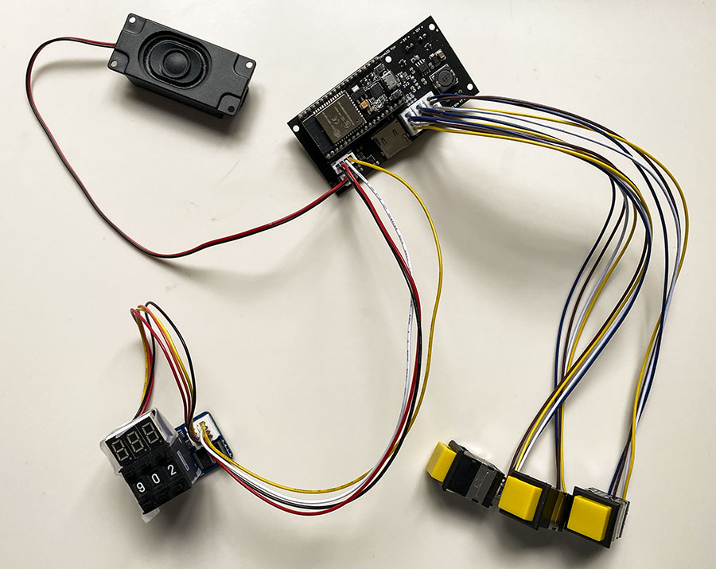
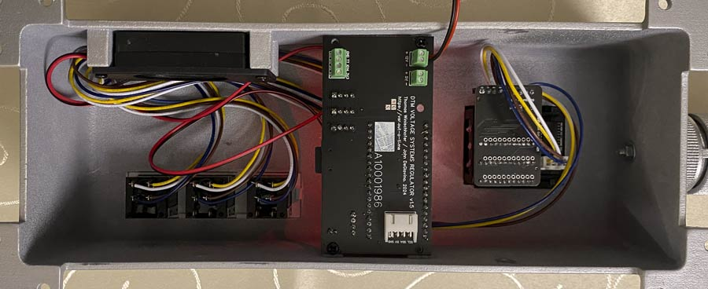

## Electronics for the VSR

A video is [here](https://www.facebook.com/61553801874212/videos/475630928153628/).

The VSR electronics consist of four PCBs:
- a Control Board
- a pushwheel controller, to which the pushwheels are attached
- two PCBs for the display: a controller and a "tube carrier".

The folders contain each
- Gerbers for production at eg. JLCPCB (.zip)
- BOMs for the PCB's (.csv)
- PickAndPlace (CPL) files for production

The buttons on the original were alledgedly "Compulite 65", but I could not find anything about those.

Suitable alternatives are [Eaton 861K11810](https://www.onlinecomponents.com/en/productdetail/cutler-hammer--eaton/861k11810-11067671.html) with [Easton 849PM04A](https://www.onlinecomponents.com/en/productdetail/cutler-hammer--eaton/849pm04a-39549100.html) caps. They are illuminated by inserting clear LEDs (with a wide angle) into the T-1 3/4 Bi-Pin sockets, and setting the LED voltage on the Control Board to 3.3V. I used 5mm Nichia NSDW570 LEDs (140 degrees, 8700mcd, 36lm).
