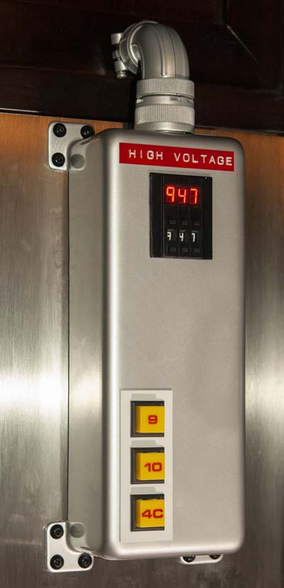

# VSR (Delorean Time Machine)

This [repository](https://vsr.out-a-ti.me) holds the most current firmware for a replica of the Voltage Systems Regulator ("VSR") known from the Delorean Time Machine, fully compatible with the [CircuitSetup](https://circuitsetup.us) line of props. A kit is in the works and will possibly be available [here](https://movieprops.blog/shop/); you can, however, make your own circuit boards using the files in the [Electronics](https://github.com/realA10001986/VSR/tree/main/Electronics) folder.

|  |
|:--:|
| Click to watch the video |

Features include

- various display modes, selectable by buttons: Pushwheel values, temperature (from directly connencted sensor, or from [Time Circuits Display](https://tcd.out-a-ti.me) via BTTFN), or speed (from a [CircuitSetup](https://circuitsetup.us) [Time Circuits Display](https://tcd.out-a-ti.me) via BTTFN)
- [Time Travel](#time-travel) sequence, triggered by button, [Time Circuits Display](https://tcd.out-a-ti.me) or via [MQTT](#home-assistant--mqtt)
- [music player](#the-music-player): Play mp3 files located on an SD card, controlled by buttons or [Time Circuits Display](https://tcd.out-a-ti.me) keypad via BTTFN
- [SD card](#sd-card) support for custom audio files for effects, and music for the Music Player
- advanced network-accessible [Config Portal](#the-config-portal) for setup (http://vsr.local, hostname configurable)
- [wireless communication](#bttf-network-bttfn) with [Time Circuits Display](https://tcd.out-a-ti.me); used for synchronized time travels, alarm, night mode, fake power, temperature display and remote control through keypad
- [Home Assistant](#home-assistant--mqtt) (MQTT 3.1.1) support
- built-in OTA installer for firmware updates and audio files

## Firmware Installation

If a previous version of the VSR firmware is installed on your device, you can update easily using the pre-compiled binary. Enter the [Config Portal](#the-config-portal), click on "Update" and select the pre-compiled binary file provided in this repository ([install/vsr-A10001986.ino.nodemcu-32s.bin](https://github.com/realA10001986/VSR/blob/main/install/vsr-A10001986.ino.nodemcu-32s.bin)). 

If you are using a fresh ESP32 board, please see [vsr-A10001986.ino](https://github.com/realA10001986/VSR/blob/main/vsr-A10001986/vsr-A10001986.ino) for detailed build and upload information, or, if you don't want to deal with source code, compilers and all that nerd stuff, go [here](https://install.out-a-ti.me) and follow the instructions.

*Important: After a firmware update, the "wait" symbol might be shown a while longer while booting. Do NOT unplug the device during this time.*

### Sound-pack installation

The firmware comes with a sound-pack which needs to be installed separately. The sound-pack is not updated as often as the firmware itself. If you have previously installed the latest version of the sound-pack, you normally don't have to re-install it when you update the firmware. Only if the VSR briefly displays "AUD" during boot, a re-installation/update of the sound-pack is needed.

The first step is to download "install/sound-pack-xxxxxxxx.zip" and extract it. It contains one file named "VSRA.bin".

Then there are two alternative ways to proceed. Note that both methods *require an SD card*.

1) Through the [Config Portal](#the-config-portal). Click on *Update*, select the "VSRA.bin" file in the bottom file selector and click on *Upload*.
   
2) Via SD card:
- Copy "VSRA.bin" to the root directory of of a FAT32 formatted SD card;
- power down the VSR,
- insert this SD card into the slot and 
- power up the VSR; the sound-pack will be installed automatically.

After installation, the SD card can be re-used for [other purposes](#sd-card).

## Initial Configuration

>The following instructions only need to be followed once, on fresh VSRs. They do not need to be repeated after a firmware update.

The first step is to establish access to the VSR's configuration web site ("Config Portal") in order to configure your VSR:

- Power up the VSR and wait until it has finished booting.
- Connect your computer or handheld device to the WiFi network "VSR-AP".
- Navigate your browser to http://vsr.local or http://192.168.4.1 to enter the Config Portal.

#### Connecting to a WiFi network

Your VSR knows two ways of WiFi operation: Either it creates its own WiFi network, or it connects to a pre-existing WiFi network.

As long as the VSR is unconfigured, it creates its own WiFi network named "VSR-AP". This mode of operation is called "**Access point mode**", or "AP-mode". 

It is ok to leave it in AP-mode, predominantly if used stand-alone. (To keep operating your VSR in AP-mode, do not configure a WiFi network as described below, or check "Forget saved WiFi network" and click "Save" on the Config Portal's "WiFi Configuration" page.)

>Please do not leave computers/hand helds permanently connected to the VSR's AP. These devices might think they are connected to the internet and therefore hammer your VSR with DNS and HTTP requests which might lead to packet loss and disruptions.

>If you want your device to remain in AP-mode, please choose a suitable WiFi channel on the Config Portal's "WiFi Configuration" page. See [here](#-wifi-channel).

>For experts: In the following, the term "WiFi network" is used for both "WiFi network" and "ip network" for simplicity reasons. However, for BTTFN/MQTT communication, the devices must (only) be on the same ip network, regardless of how they take part in it: They can be can be connected to different WiFi networks, if those WiFi networks are part of the same ip network, or, in case of the MQTT broker, by wire. If the TCD operates as access point for other props, connecting a prop to the TCD's WiFi network also takes care of suitable ip network configuration through DHCP.

##### &#9654; Home setup with a pre-existing local WiFi network

In this case, you can connect your VSR to your home WiFi network: Click on "WiFi Configuration" and either select a network from the top of the page or enter a WiFi network name (SSID), and enter your WiFi password. After saving the WiFi network settings, your VSR reboots and tries to connect to your selected WiFi network. If that fails, it will again start in access point mode.

>If you have a [Time Circuits Display](https://tcd.out-a-ti.me) note that in order to have both VSR and TCD communicate with each other, your VSR must be connected to the same network your TCD is connected to. In order to use MQTT, your VSR must be connected to the same network your broker is connected to.

>Your VSR requests an IP address via DHCP, unless you entered valid data in the fields for static IP addresses (IP, gateway, netmask, DNS). If the device is inaccessible as a result of incorrect static IPs, wait until the VSR has completed its startup sequence, then hold all three buttons until "ADM" is displayed, then _hold_ button "4C". After "RST" has been displayed, power-down the VSR. Upon power-up, the device is reset to DHCP.

##### &#9654; Places without a WiFi network

In this case and with no [Time Circuits Display](https://tcd.out-a-ti.me) at hand, keep your VSR operating in AP-mode.

If you have a [Time Circuits Display](https://tcd.out-a-ti.me), you can connect your VSR to the TCD's own WiFi network. Run the TCD in AP-Mode, and on your VSR's Config Portal, click on "WiFi Configuration" and either select "TCD-AP" from the top of the page or enter "TCD-AP" under *Network name (SSID)*. If you password-proteced your TCD-AP, enter this password below. See [here](#car-setup) for more details.

After completing WiFi setup, your VSR is ready for use; you can also continue configuring it to your personal preferences through the Config Portal.

## The Config Portal

The "Config Portal" is the VSR's configuration web site. 

|  |
|:--:| 
| *The Config Portal's main page* |

It can be accessed as follows:

#### If VSR is in AP mode

- Connect your computer or handheld device to the WiFi network "VSR-AP".
- Navigate your browser to http://vsr.local or http://192.168.4.1 to enter the Config Portal.
- (For proper operation, please disconnect your computer or handheld from VSR-AP when you are done with configuring your VSR. These devices can cause high network traffic, resulting in severe performance penalties.)

#### If VSR is connected to a WiFi network

- Connect your hand-held/computer to the same (WiFi) network to which your VSR is connected, and
- navigate your browser to http://vsr.local

  >Accessing the Config Portal through this address requires the operating system of your hand-held/computer to support Bonjour/mDNS: Windows 10 version TH2     (1511) [other sources say 1703] and later, Android 13 and later; MacOS and iOS since the dawn of time.

  >If connecting to http://vsr.local fails due to a name resolution error, you need to find out your VSR's IP address: Hold all three buttons until "ADM" is displayed, release all buttons and afterwards _hold_ button "9". Your VSR will display its current IP address (a. - b. - c. - d). Then, on your handheld or computer, navigate to http://a.b.c.d (a.b.c.d being the IP address as displayed on your VSR) in order to enter the Config Portal.

In the main menu, click on "Settings" to configure your VSR. 

|  |
|:--:| 
| *Click for full screenshot* |

A full reference of the Config Portal is [here](#appendix-a-the-config-portal).

## Basic Operation

By default, the display shows the value selected by the pushwheels, with slight fluctuations (which can be disabled in the Config Portal). Changing the pushwheels results in the display adapting to the new value, which is done smoothly (which also can be disabled in the Config Portal).

### Display modes

The three-digit display can be used for the pushwheel number, temperature or speed.

In order to display temperature, a temperature sensor needs to be connected to either your VSR or your Time Circuits Display (TCD), and in the latter case your VSR needs to be connected to the TCD via BTTFN.

In order to display speed, a TCD with either a GPS receiver or a rotary encoder for speed is required, and your VSR needs to be connected to the TCD via BTTFN.

Display modes are chosen by selecting the _Operation_ button mode, and then _holding_ a single button until two beeps are emitted from your VSR, as described below.

### Button modes

>Buttons can be _pressed_, which means a brief press-and-release, or _held_, meaning pressing and holding the button for 2 seconds.

There are four button modes: Light ("LGT"), Operation ("OPR"), Music Player ("MUS") and Admin ("ADM"). In order to select a button mode, two or three buttons must be _held_ simultaneously until the display shows the selected mode.

<table>
    <tr>
    <td align="center"></td><td><a href="#light-mode">Light mode</a></td>
    </tr>
    <tr>
    <td align="center"></td><td><a href="#operation-mode">Operation mode</a></td>
    </tr>
    <tr>  
    <td align="center"></td><td><a href="#music-player-mode">MusicPlayer mode</a></td>
    </tr>
    <tr>
    <td align="center"></td><td><a href="#admin-mode">Admin mode</a></td>
    </tr>
</table>

#### Light mode 

In this mode, the buttons light up when briefly pressed, and stay lit after _holding_ a button. At the next press, the light will go off again. This mode is only for playing with the lights, the buttons have no other function.

#### Operation mode

  <table>
    <tr><td></td><td>Brief press</td><td>Hold</td></tr>
    <tr>
     <td align="center"></td><td>Trigger time travel</td>
     <td><a href="#display-modes">Display mode</a>: Pushwheel number</td>
    <tr>
     <td align="center"></td><td>Play "<a href="#additional-custom-sounds">key3.mp3</a>" on SD</td>
      <td><a href="#display-modes">Display mode</a>: <a href="#temperature-display">Temperature</a></td>
    </tr>
    <tr>
     <td align="center"></td><td>Play "<a href="#additional-custom-sounds">key6.mp3</a>" on SD</td>
      <td><a href="#display-modes">Display mode</a>: <a href="#speed-display">Speed</a></td>
    </tr>
</table>

#### Music Player mode

  <table>
     <tr><td></td><td>Brief press</td><td>Hold</td></tr>
    <tr>
     <td align="center"></td><td>Previous song</td>
      <td>Disable shuffle mode</td>
    </tr>
    <tr>
     <td align="center"></td><td>Play/Stop</td>
      <td>Enable shuffle mode</td>
    </tr>
    <tr>
     <td align="center"></td><td>Next song</td>
      <td>Go to song #0</td>
    </tr>
</table>

#### Admin mode

  <table>
    <tr><td></td><td>Brief press</td><td>Hold</td></tr>
    <tr>
     <td align="center"></td><td>Volume up</td><td>Display IP address</td>
    </tr>
    <tr>
     <td align="center"></td><td>Volume down</td><td>-</td>
    </tr>
    <tr>
     <td align="center"></td><td></td><td>Delete static IP and AP password</td>
    </tr>
</table>

[Here](https://github.com/realA10001986/VSR/blob/main/CheatSheet.pdf) is a cheat sheet for printing or screen-use. (Note that MacOS' preview application has a bug that scrambles the links in the document. Acrobat Reader does it correctly.)

### TCD remote command reference

<table>
   <tr><td>Function</td><td>Code on TCD</td></tr>
    <tr>
     <td align="left">Select pushwheel display mode</td>
     <td align="left">8010&#9166;</td>
    </tr>
    <tr>
     <td align="left">Select <a href="#temperature-display">temperature</a> display mode</td>
     <td align="left">8011&#9166;</td>
    </tr>
    <tr>
     <td align="left">Select <a href="#speed-display">speed</a> display mode</td>
     <td align="left">8012&#9166;</td>
    </tr>
    <tr>
     <td align="left">Set volume level (00-19)</td>
     <td align="left">8300&#9166; - 8319&#9166;</td>
    </tr>
    <tr>
     <td align="left">Set brightness level (00-15)</td>
     <td align="left"<td>8400&#9166; - 8415&#9166;</td>
    </tr>
    <tr>
     <td align="left"><a href="#the-music-player">Music Player</a>: Play/Stop</td>
     <td align="left">8005&#9166;</td>
    </tr>
    <tr>
     <td align="left"><a href="#the-music-player">Music Player</a>: Previous song</td>
     <td align="left">8002&#9166;</td>
    </tr>
    <tr>
     <td align="left"><a href="#the-music-player">Music Player</a>: Next song</td>
     <td align="left">8008&#9166;</td>
    </tr>
    <tr>
     <td align="left"><a href="#the-music-player">Music Player</a>: Select music folder (0-9)</td>
     <td align="left">8050&#9166; - 8059&#9166;</td>
    </tr>
    <tr>
     <td align="left"><a href="#the-music-player">Music Player</a>: Shuffle off</td>
     <td align="left">8222&#9166;</td>
    </tr>
    <tr>
     <td align="left"><a href="#the-music-player">Music Player</a>: Shuffle on</td>
     <td align="left">8555&#9166;</td>
    </tr> 
    <tr>
     <td align="left"><a href="#the-music-player">Music Player</a>: Go to song 0</td>
     <td align="left">8888&#9166;</td>
    </tr>
    <tr>
     <td align="left"><a href="#the-music-player">Music Player</a>: Go to song xxx</td>
     <td align="left">8888xxx&#9166;</td>
    </tr>
    <tr>
     <td align="left">Play "<a href="#additional-custom-sounds">key1.mp3</a>"</td>
     <td align="left">8001&#9166;</td>
    </tr>
    <tr>
     <td align="left">Play "<a href="#additional-custom-sounds">key3.mp3</a>"</td>
     <td align="left">8003&#9166;</td>
    </tr>
    <tr>
     <td align="left">Play "<a href="#additional-custom-sounds">key4.mp3</a>"</td>
     <td align="left">8004&#9166;</td>
    </tr>
    <tr>
     <td align="left">Play "<a href="#additional-custom-sounds">key6.mp3</a>"</td>
     <td align="left">8006&#9166;</td>
    </tr>
    <tr>
     <td align="left">Play "<a href="#additional-custom-sounds">key7.mp3</a>"</td>
     <td align="left">8007&#9166;</td>
    </tr>
    <tr>
     <td align="left">Play "<a href="#additional-custom-sounds">key9.mp3</a>"</td>
     <td align="left">8009&#9166;</td>
    </tr>
    <tr>
     <td align="left">Display current IP address</td>
     <td align="left">8090&#9166;</td>
    </tr>   
    <tr>
     <td align="left">Reboot the device</td>
     <td align="left">8064738&#9166;</td>
    </tr>
     <tr>
     <td align="left">Delete static IP address and WiFi-AP password</td>
     <td align="left">8123456&#9166;</td>
    </tr>
</table>

[Here](https://github.com/realA10001986/VSR/blob/main/CheatSheet.pdf) is a cheat sheet for printing or screen-use. (Note that MacOS' preview application has a bug that scrambles the links in the document. Acrobat Reader does it correctly.)

## Time travel

To trigger a "time travel" stand-alone, select the _Operation_ [button mode](#button-modes), and press "9".

You can also connect a dedicated time travel button to your VSR; the button must connect "TT" to "3.3V" on the "Time Travel" connector. Pressing this button briefly will trigger a time travel.

Other ways of triggering a time travel are available if a [Time Circuits Display](#connecting-a-time-circuits-display) is connected.

## Temperature display

As mentioned above, your VSR can display temperature. The temperature value can come from either a connected temperature sensor, or from the TCD - if the latter has a sensor connected and is connected to your VSR via [BTTFN](#bttf-network-bttfn).

The following sensor types are supported for direct (i2c) connection to your VSR: 
- [MCP9808](https://www.adafruit.com/product/1782) (address 0x18 - non-default),
- [BMx280](https://www.adafruit.com/product/2652) (0x77),
- [SI7021](https://www.adafruit.com/product/3251),
- [SHT40](https://www.adafruit.com/product/4885) (0x44),
- [SHT45](https://www.adafruit.com/product/5665) (0x44),
- [TMP117](https://www.adafruit.com/product/4821) (0x49),
- [AHT20/AM2315C](https://www.adafruit.com/product/4566),
- [HTU31D](https://www.adafruit.com/product/4832) (0x41 - non-default),
- [MS8607](https://www.adafruit.com/product/4716),
- [HDC302x](https://www.adafruit.com/product/5989) (0x45 - non-default)

All of those are readily available on breakout boards from Adafruit or Seeed (Grove); the links in above list lead to tested example products.

The sensor needs to be wired as follows:

<table>
    <tr>
     <td align="center">Sensor PCB</td><td align="center">VSR control board</td>
    </tr>    
    <tr>
     <td align="center">GND or "-"</td>
     <td align="center">GND</td>
    </tr>
    <tr>
     <td align="center">VIN or 5V or "+"</a></td>
     <td align="center">5V</td>
    </tr>
    <tr>
     <td align="center">SDA (SDI on BME280)</td>
     <td align="center">SDA</td>
    </tr>
    <tr>
     <td align="center">SCL (SCK on BME280)</td>
     <td align="center">SCL</td>
    </tr>
</table>

For longer cables, ie >50cm (>20in), I recommend using a twisted pair cable, and to connect it as follows:

>Important: The VSR control board delivers and drives the i2c bus on 5V. Most sensors operate on 3.3V. Therefore, you cannot connect the chips directly to the VSR control board without a level-shifter. This goes for the power supply as well as the i2c bus signals (SDA, SCL). I only use readily available sensor breakout boards that include level-shifters.

## Speed display

Your VSR can also display speed, provided a TCD is connected through [BTTFN](#bttf-network-bttfn), and the TCD has either a GPS receiver, or a rotary encoder configured for speed. Please see [here](https://tcd.out-a-ti.me) for more information.

## SD card

Preface note on SD cards: For unknown reasons, some SD cards simply do not work with this device. For instance, I had no luck with Sandisk Ultra 32GB and  "Intenso" cards. If your SD card is not recognized, check if it is formatted in FAT32 format (not exFAT!). Also, the size must not exceed 32GB (as larger cards cannot be formatted with FAT32). Transcend, Sandisk Industrial, Verbatim Premium and Samsung Pro Endurance SDHC cards work fine in my experience.

The SD card, apart from being required for [installing](#sound-pack-installation) of the sound-pack, can be used for substituting built-in sound effects and for music played back by the [Music player](#the-music-player). Also, it is _strongly recommended_ to store [secondary settings](#-save-secondary-settings-on-sd) on the SD card to minimize [Flash Wear](#flash-wear).

Note that the SD card must be inserted before powering up the device. It is not recognized if inserted while the VSR is running. Furthermore, do not remove the SD card while the device is powered.

### Sound substitution

The VSR's built-in sound effects can be substituted by your own sound files on a FAT32-formatted SD card. These files will be played back directly from the SD card during operation, so the SD card has to remain in the slot.

Your replacements need to be put in the root (top-most) directory of the SD card, be in mp3 format (128kbps max) and named as follows:
- "startup.mp3". Played when the VSR is connected to power and has finished booting;
- "ttstart,mp3"/"ttend.mp3". Played at the beginning/the end of a time travel sequence. (The "humm" sound cannot be substituted.)
- "alarm.mp3". Played when the alarm sounds (triggered by a Time Circuits Display via BTTFN or MQTT);
- "button.mp3", "buttonl.mp3", "button_bad.mp3": Button click sounds.

### Additional Custom Sounds

The firmware supports some additional user-provided sound effects, which it will load from the SD card. If the respective file is present, it will be used. If that file is absent, no sound will be played.

- "key3.mp3"/"key6.mp3": Will be played when you press "10" or "4C" in _Operation_ [button mode](#button-modes), or type 8003 / 8006 on the TCD's keypad (connected through BTTFN);
- "key1.mp3", "key4.mp3", "key7.mp3", "key9.mp3": Will be played when you type 8001 / 8004 / 8007 / 8009 on the TCD's keypad (connected through BTTFN).

> The seemingly odd numbering is because of synchronicity with other props, especially the TCD and its keymap where the MusicPlayer occupies keys 2, 5, 8.

Those files are not provided here. You can use any mp3, with a bitrate of 128kpbs or less.

### Installing Custom & Replacement Audio Files

As of version 1.15 of the VSR firmware, above mentioned audio files (both replacements and custom sounds) can either be copied to the SD card using a computer (as before), or uploaded through the Config Portal.

Uploading through the Config Portal works exactly like [installing the default audio files](#sound-pack-installation); on the main menu, click "UPDATE". Afterwards choose one or more mp3 files to upload using the bottom file selector, and click "UPLOAD". The firmware will store the uploaded mp3 files on the SD card.

In order to delete a file from the SD card, upload a file whose name is prefixed with "delete-". For example: To delete "key3.mp3" from the SD card, upload a file named "delete-key3.mp3"; the file's contents does not matter, so it's easiest to use a newly created empty file. The firmware detects the "delete-" part and, instead of storing the uploaded file, it throws it away and deletes "key3.mp3" from the SD card.

For technical reasons, the VSR must reboot after mp3 files are uploaded in this way.

Please remember that the maximum bitrate for mp3 files is 128kbps. Also note that the uploaded file is stored to the root folder of the SD card, so this way of uploading cannot be used to upload songs for the Music Player. 

## The Music Player

The firmware contains a simple music player to play mp3 files located on the SD card. 

In order to be recognized, your mp3 files need to be organized in music folders named *music0* through *music9*. The folder number is 0 by default, ie the player starts searching for music in folder *music0*. This folder number can be changed in the Config Portal or through the TCD keypad (805x).

The names of the audio files must only consist of three-digit numbers, starting at 000.mp3, in consecutive order. No numbers should be left out. Each folder can hold up to 1000 files (000.mp3-999.mp3). *The maximum bitrate is 128kpbs.*

Since manually renaming mp3 files is somewhat cumbersome, the firmware can do this for you - provided you can live with the files being sorted in alphabetical order: Just copy your files with their original filenames to the music folder; upon boot or upon selecting a folder containing such files, they will be renamed following the 3-digit name scheme (as mentioned: in alphabetic order). You can also add files to a music folder later, they will be renamed properly; when you do so, delete the file "TCD_DONE.TXT" from the music folder on the SD card so that the firmware knows that something has changed. The renaming process can take a while (10 minutes for 1000 files in bad cases). Mac users are advised to delete the ._ files from the SD before putting it back into the control board as this speeds up the process.

To start and stop music playback, press button "10" while in _MusicPlayer_ [button mode](#button-modes). Pressing "9" jumps to the previous song, pressing "4C" to the next one. (The same can be achieved by entering codes on the TCD's keypad: 8002 = previous song, 8005 = play/stop, 8008 = next song).

By default, the songs are played in order, starting at 000.mp3, followed by 001.mp3 and so on. _Holding_ button "10" enables Shuffle mode, button "9" disables Shuffle mode. _Holding_ "4C" restarts the player at song number 0. The power-up Shuffle mode can be set up in the Config Portal.

See [here](#music-player-mode) and [here](#tcd-remote-command-reference) for a list of controls of the music player.

While the music player is playing music, other sound effects are disabled/muted. Initiating a time travel stops the music player. The TCD-triggered alarm will, if so configured, sound and stop the music player.

## Connecting a Time Circuits Display

### BTTF-Network ("BTTFN")

The TCD can communicate with the VSR wirelessly, via the built-in "**B**asic-**T**elematics-**T**ransmission-**F**ramework" over WiFi. It can send out information about a time travel and an alarm, and the VSR queries the TCD for speed, temperature and some other data. Furthermore, the TCD's keypad can be used to remote-control the VSR.

|  |
|:--:|
| Click to watch the video |

Note that the TCD's firmware must be up to date for BTTFN. You can use [this](http://tcd.out-a-ti.me) one or CircuitSetup's release 2.9 or later.

In order to connect your VSR to the TCD using BTTFN, just enter the TCD's IP address or hostname in the **_IP address or hostname of TCD_** field in the VSR's Config Portal. On the TCD, no special configuration is required. 
  
Afterwards, the VSR and the TCD can communicate wirelessly and 
- play time travel sequences in sync,
- both play an alarm-sequence when the TCD's alarm occurs,
- the VSR can be remote controlled through the TCD's keypad (command codes 8xxx),
- the VSR queries the TCD for temperature and GPS speed for display,
- the VSR queries the TCD for fake power and night mode, in order to react accordingly if so configured,
- the VSR's Time Travel button can trigger a synchronized Time Travel on all BTTFN-connected devices, just like if that Time Travel was triggered through the TCD.

You can use BTTF-Network and MQTT at the same time, see [below](#home-assistant--mqtt).

### Connecting a TCD by wire

>Note that a wired connection only allows for synchronized time travel sequences, no other communication takes place. A wireless connection over BTTFN/WiFi is much more powerful and therefore recommended over a wired connection.

For a connection by wire, connect GND and GPIO on the VSR's "Time Travel" connector to the TCD like in the table below:

<table>
    <tr>
     <td align="center">VSR</td>
     <td align="center">TCD with control board >=1.3</td>
     <td align="center">TCD with control board 1.2</td>
    </tr>
   <tr>
     <td align="center">GND of "Time Travel" connector</td>
     <td align="center">GND of "Time Travel" connector</td>
     <td align="center">GND of "IO14" connector</td>
    </tr>
    <tr>
     <td align="center">TT of "Time Travel" connector</td>
     <td align="center">TT OUT of "Time Travel" connector</td>
     <td align="center">IO14 of "IO14" connector</td>
    </tr>
</table>

_Do not connect 3V3 to the TCD!_

Next, head to the Config Portal and set the option **_TCD connected by wire_**. On the TCD, the option "Control props connected by wire" must be set.

>You can connect both the TCD and a button to the TT connector. However, the button should not be pressed when the option **_TCD connected by wire_** is set, as it might yield unwanted results. Also, note that the button connects to IO13 and 3_3V (not GND!).

## Home Assistant / MQTT

The VSR supports the MQTT protocol version 3.1.1 for the following features:

### Control the VSR via MQTT

The VSR can - to some extent - be controlled through messages sent to topic **bttf/vsr/cmd**. Supported commands are
- TIMETRAVEL: Start a [time travel](#time-travel)
- DISPLAY_PW: Set [display mode](#display-modes) to "pushwheels"
- DISPLAY_TEMP: Set [display mode](#display-modes) to "temperature"
- DISPLAY_SPEED: Set [display mode](#display-modes) to "speed"
- MP_PLAY: Starts the [Music Player](#the-music-player)
- MP_STOP: Stops the [Music Player](#the-music-player)
- MP_NEXT: Jump to next song
- MP_PREV: Jump to previous song
- MP_SHUFFLE_ON: Enables shuffle mode in [Music Player](#the-music-player)
- MP_SHUFFLE_OFF: Disables shuffle mode in [Music Player](#the-music-player)
- MP_FOLDER_x: x being 0-9, set Music Folder number for [Music Player](#the-music-player)

### Receive commands from Time Circuits Display

If both TCD and VSR are connected to the same broker, and the option **_Send event notifications_** is checked on the TCD's side, the VSR will receive information on time travel and alarm and play their sequences in sync with the TCD. Unlike BTTFN, however, no other communication takes place.

MQTT and BTTFN can co-exist. However, the TCD only sends out time travel and alarm notifications through either MQTT or BTTFN, never both. If you have other MQTT-aware devices listening to the TCD's public topic (bttf/tcd/pub) in order to react to time travel or alarm messages, use MQTT (ie check **_Send event notifications_**). If only BTTFN-aware devices are to be used, uncheck this option to use BTTFN as it has less latency.

### Setup

In order to connect to a MQTT network, a "broker" (such as [mosquitto](https://mosquitto.org/), [EMQ X](https://www.emqx.io/), [Cassandana](https://github.com/mtsoleimani/cassandana), [RabbitMQ](https://www.rabbitmq.com/), [Ejjaberd](https://www.ejabberd.im/), [HiveMQ](https://www.hivemq.com/) to name a few) must be present in your network, and its address needs to be configured in the Config Portal. The broker can be specified either by domain or IP (IP preferred, spares us a DNS call). The default port is 1883. If a different port is to be used, append a ":" followed by the port number to the domain/IP, such as "192.168.1.5:1884". 

If your broker does not allow anonymous logins, a username and password can be specified.

Note that MQTT is disabled when your VSR is operated in AP-mode or when connected to the TCD run in AP-Mode (TCD-AP).

Limitations: MQTT Protocol version 3.1.1; TLS/SSL not supported; ".local" domains (MDNS) not supported; server/broker must respond to PING (ICMP) echo requests. For proper operation with low latency, it is recommended that the broker is on your local network. 

## Car setup

If your VSR, along with a [Time Circuits Display](https://tcd.out-a-ti.me/), is mounted in a car, the following network configuration is recommended:

#### TCD

- Run your TCD in [*car mode*](https://tcd.out-a-ti.me/#car-mode);
- disable WiFi power-saving on the TCD by setting **_Power save timer_** to 0 (zero) in the "AP-mode settings" section on the WiFi Configuration page.

#### VSR

Enter the Config Portal on the VSR, click on *Setup* and
  - enter *192.168.4.1* into the field **_IP address or hostname of TCD_** under BTTFN settings;
  - check the option **_Follow TCD fake power_** if you have a fake power switch for the TCD (like eg a TFC switch)
  - click on *Save*.

After the VSR has restarted, re-enter the VSR's Config Portal (while the TCD is powered and in *car mode*) and
  - click on *WiFi Configuration*,
  - select the TCD's access point name in the list at the top ("TCD-AP"; if there is no list, click on "WiFi Scan") or enter *TCD-AP* into the *Network name (SSID)* field; if you password-protected your TCD's AP, enter this password in the *password* field. Leave all other fields empty,
  - click on *Save*.

In order to access the VSR's Config Portal in your car, connect your hand held or computer to the TCD's WiFi access point ("TCD-AP"), and direct your browser to http://vsr.local ; if that does not work, go to the TCD's keypad menu, press ENTER until "BTTFN CLIENTS" is shown, hold ENTER, and look for the VSR's IP address there; then direct your browser to that IP by using the URL http://a.b.c.d (a-d being the IP address displayed on the TCD display).

This "car setup" can also be used in a home setup with no local WiFi network present.

## Flash Wear

Flash memory has a somewhat limited lifetime. It can be written to only between 10.000 and 100.000 times before becoming unreliable. The firmware writes to the internal flash memory when saving settings and other data. Every time you change settings, data is written to flash memory.

In order to reduce the number of write operations and thereby prolong the life of your VSR, it is recommended to use a good-quality SD card and to check **_[Save secondary settings on SD](#-save-secondary-settings-on-sd)_** in the Config Portal; secondary settings are then stored on the SD card (which also suffers from wear but is easy to replace). See [here](#-save-secondary-settings-on-sd) for more information.

## Appendix A: The Config Portal

### Main page

##### &#9654; WiFi Configuration

This leads to the [WiFi configuration page](#wifi-configuration)

##### &#9654; Settings

This leads to the [Settings page](#settings).

##### &#9654; Update

This leads to the firmware and audio update page. 

In order to upload a new firmware binary (such as the ones published here in the install/ folder), select that image file in the top file selector and click "Update".

You can also install the VSR's audio data on this page; download the current sound-pack, extract it and select the resulting VSRA.bin file in the bottom file selector. Finally, click "Upload". Note that an SD card is required for this operation.

Note that either a firmware or audio data can be uploaded at once, not both at the same time.

Finally, this page is also for uploading [custom or replacement sound files](#installing-custom--replacement-audio-files) to the SD card. Select an mp3 file in the bottom file selector and click upload. (Requires firmware 1.15 or later. Maximum 16 files at a time.)

---

### WiFi Configuration

Through this page you can either connect your VSR to your local WiFi network, or configure AP mode. 

#### <ins>Connecting to an existing WiFi network</ins>

In order to connect your VSR to your WiFi network, all you need to do is either to click on one of the networks listed at the top or to enter a __Network name (SSID)__, and optionally a __passwort__ (WPAx). If there is no list displayed, click on "WiFi Scan".

>By default, the VSR requests an IP address via DHCP. However, you can also configure a static IP for the VSRC by entering the IP, netmask, gateway and DNS server. All four fields must be filled for a valid static IP configuration. If you want to stick to DHCP, leave those four fields empty. If you connect your VSR to your Time Circuits Display acting as access point ("TCD-AP"), leave these all empty.

##### &#9654; Forget Saved WiFi Network

Checking this box (and clicking SAVE) deletes the currently saved WiFi network (SSID and password as well as static IP data) and reboots the device; it will restart in "access point" (AP) mode. See [here](#connecting-to-a-wifi-network).

##### &#9654; Hostname

The device's hostname in the WiFi network. Defaults to 'vsr'. This also is the domain name at which the Config Portal is accessible from a browser in the same local network. The URL of the Config Portal then is http://<i>hostname</i>.local (the default is http://vsr.local).

If you have more than one VSR in your local network, please give them unique hostnames.

_This setting applies to both AP-mode and when your VSR is connected to a WiFi network._ 

##### &#9654; WiFi connection attempts

Number of times the firmware tries to reconnect to a WiFi network, before falling back to AP-mode. See [here](#connecting-to-a-wifi-network)

##### &#9654; WiFi connection timeout

Number of seconds before a timeout occurs when connecting to a WiFi network. When a timeout happens, another attempt is made (see immediately above), and if all attempts fail, the device falls back to AP-mode. See [here](#connecting-to-a-wifi-network)

#### <ins>Settings for AP-mode</ins>

##### &#9654; Network name (SSID) appendix

By default, when your VSR creates a WiFi network of its own ("AP-mode"), this network is named "VSR-AP". In case you have multiple VSRs in your vicinity, you can have a string appended to create a unique network name. If you, for instance, enter "-ABC" here, the WiFi network name will be "VSR-AP-ABC". Characters A-Z, a-z, 0-9 and - are allowed.

##### &#9654; Password

By default, and if this field is empty, the VSR's own WiFi network ("VSR-AP") will be unprotected. If you want to protect your VSR access point, enter your password here. It needs to be 8 characters in length and only characters A-Z, a-z, 0-9 and - are allowed.

If you forget this password and are thereby locked out of your VSR, select _Admin_ [button mode](#button-modes), and _hold_ "4C"; "RST" will be displayed, and your WiFi password is deleted. Then power-down and power-up your VSR and the access point will start unprotected.

##### &#9654; WiFi channel

Here you can select one out of 11 channels, or have the VSR choose a random channel for you. The default channel is 1. Preferred are channels 1, 6 and 11.

WiFI channel selection is key for a trouble-free operation. Disturbed WiFi communication can lead to disrupted sequences, packet loss, hanging or freezing props, and other problems. A good article on WiFi channel selection is [here](https://community.ui.com/questions/Choosing-the-right-Wifi-Channel-on-2-4Ghz-Why-Conventional-Wisdom-is-Wrong/ea2ffae0-8028-45fb-8fbf-60569c6d026d).

If a WiFi Scan was done (which can be triggered by clicking "WiFI Scan"), 

- a list of networks is displayed at the top of the page; click "Show All" to list all networks including their channel;
- a "proposed channel" is displayed near the "WiFi channel" drop-down, based on a rather simple heuristic. The banner is green when a channel is excellent, grey when it is impeded by overlapping channels, and when that banner is red operation in AP mode is not recommended due to channels all being used.

The channel proposition is based on all WiFi networks found; it does not take non-WiFi equipment (baby monitors, cordless phones, bluetooth devices, microwave ovens, etc) into account. 

---

### Settings

#### <ins>Basic settings</ins>

##### &#9654; Smooth voltage changes

If this option is checked, the display follows pushwheel changes smoothly, ie in several steps. If this is unchecked, the display follows the pushwheels immediately.

##### &#9654; Voltage fluctuations

If this option is checked, the displayed pushwheel value slightly and randomly fluctuates. If this option is unchecked, the pushwheel value is statically displayed, without any fluctuations.

##### &#9654; Display button mode on power-up

If this is checked, the VSR briefly shows the current [button mode](#button-modes) upon power-up.

##### &#9654; Lights indicate button mode

If this is checked, the button lights permanently reflect the current [button mode](#button-modes), except for _light mode_.

##### &#9654; Play time travel sounds

If other props are connected, they might bring their own time travel sound effects. In this case, you can uncheck this to disable the VSR's own time travel sounds. Note that this only covers sounds played during time travel, not other sound effects.

##### &#9654; Play TCD-alarm sounds

If a TCD is connected via BTTFN or MQTT, the VSR visually signals when the TCD's alarm sounds. If you want the VSR to play an alarm sound, check this option.

##### &#9654; Brightness level

This selects the brightness level for the LED display.

##### &#9654; Screen saver timer

Enter the number of minutes until the Screen Saver should become active when the VSR is idle.

The Screen Saver, when active, disables all lights and the display, until 
- a button on the VSR pressed,
- the time travel button is briefly pressed (the first press when the screen saver is active will not trigger a time travel),
- on a connected TCD, a destination date is entered (only if TCD is wirelessly connected) or a time travel event is triggered (also when wired).

The music player will continue to run.
 
#### <ins>Volume settings</ins>

##### Volume level (0-19)

Enter a value between 0 (mute) or 19 (very loud) here. 

This can also be set/changed via the VSR's buttons in _Admin_ [button mode](#button-modes) or through a TCD keypad via BTTFN (8300 - 8319); in both cases the change will be saved 10 seconds after it occurred.

#### <ins>Music Player settings</ins>

##### &#9654; Music folder

Selects the current music folder, can be 0 through 9. 

This can also be set/changed through a TCD keypad via BTTFN (8050 - 8059). Such a change will be saved immediately.

##### &#9654; Shuffle at startup

When checked, songs are shuffled when the device is booted. When unchecked, songs will be played in order.

Shuffle mode can be changed at any time through the VSR's buttons in _MusicPlayer_ [button mode](#music-player-mode) or via TCD (8222/8555); however, a change through buttons or TCD is not saved.

#### <ins>Settings for Night Mode</ins>

##### &#9654; Display off

If this is checked, the LED display is switched off in night mode. Otherwise, it will be dimmed.

#### <ins>Settings for temperature display</ins>

##### &#9654; Display in °Celsius

Selects between Fahrenheit and Celsius for temperature display. This settings is used for temperature both from a sensor connected to the VSR as well as temperature transmitted by a TCD.

##### &#9654; Sensor Offset

This offset, which can range from -3.0 to 3.0, is added to the sensor measurement, in order to compensate sensor inaccuracy or suboptimal sensor placement. This offset is only applied to a value read from a sensor connected to the VSR, and ignored when temperature is transmitted from a TCD; the TCD has its own Offset setting which is applied to the temperature reading before transmission.

#### <ins>Settings for BTTFN communication</ins>

##### &#9654; IP address or hostname of TCD

If you want to have your VSR to communicate with a Time Circuits Display wirelessly ("BTTF-Network"), enter the TCD's hostname - usually 'timecircuits' - or IP address here.

If you connect your VSR to the TCD's access point ("TCD-AP"), the TCD's IP address is 192.168.4.1.

##### &#9654; Follow TCD night-mode

If this option is checked, and your TCD goes into night mode, the VSR will disable or dim the display and the button lights, and reduce its audio volume.

##### &#9654; Follow TCD fake power

If this option is checked, and your TCD is equipped with a fake power switch, the VSR will also fake-power up/down. If fake power is off, the VSR will be dark and it will ignore all input from buttons.

##### &#9654; TT buttons trigger BTTFN-wide TT

If the VSR is connected to a TCD through BTTFN, this option allows to trigger a synchronized time travel on all BTTFN-connected devices when pressing "9" in _Operation_ [button mode](#button-modes), or pressing the Time Travel button, just as if the time travel was triggered by the TCD. If this option is unchecked, these actions only trigger a time travel sequence on the VSR.

##### &#9654; Ignore network-wide TTs

If this is checked, the VSR ignores network-wide (BTTFN, MQTT) time travels. After all, the VSR is never shown in the movies during a time travel, so its behavior is uncertain. If you don't like the made-up time travel sequence, check this option.

#### <ins>Home Assistant / MQTT settings</ins>

##### &#9654; Use Home Assistant (MQTT 3.1.1)

If checked, the VSR will connect to the broker (if configured) and send and receive messages via [MQTT](#home-assistant--mqtt)

##### &#9654; Broker IP[:port] or domain[:port]

The broker server address. Can be a domain (eg. "myhome.me") or an IP address (eg "192.168.1.5"). The default port is 1883. If different port is to be used, it can be specified after the domain/IP and a colon ":", for example: "192.168.1.5:1884". Specifying the IP address is preferred over a domain since the DNS call adds to the network overhead. Note that ".local" (MDNS) domains are not supported.

##### &#9654; User[:Password]

The username (and optionally the password) to be used when connecting to the broker. Can be left empty if the broker accepts anonymous logins.

#### <ins>Settings for wired connections</ins>

##### &#9654; TCD connected by wire

Check this if you have a Time Circuits Display connected by wire. Note that a wired connection only allows for synchronized time travel sequences, no other communication takes place.

While you can connect both a button and the TCD to the "time travel" connector on the VSR, the button should not be pressed when this option is set, as it might yield unwanted effects.

Do NOT check this option if your TCD is connected wirelessly (BTTFN, MQTT).

##### &#9654; TCD signals Time Travel without 5s lead

Usually, the TCD signals a time travel with a 5 seconds lead, in order to give a prop a chance to play an acceleration sequence before the actual time travel takes place. Since this 5 second lead is unique to CircuitSetup props, and people sometimes want to connect third party props to the TCD, the TCD has the option of skipping this 5 seconds lead. If that is the case, and your VSR is connected by wire, you need to set this option.

If your VSR is connected wirelessly, this option has no effect.

#### <ins>Other settings</ins>

##### &#9654; Save secondary settings on SD

If this is checked, secondary settings (volume, brightness, button mode) are stored on the SD card (if one is present). This helps to minimize write operations to the internal flash memory and to prolong the lifetime of your VSR. See [Flash Wear](#flash-wear).

Apart from Flash Wear, there is another reason for using an SD card for settings: Writing data to internal flash memory can cause delays of up to 1.5 seconds, which interrupt sound playback and have other undesired effects. The VSR needs to save data from time to time, so in order for a smooth experience without unexpected and unwanted delays, please use an SD card and check this option.

It is safe to have this option checked even with no SD card present.

If you want copy settings from one SD card to another, do as follows:
- With the old SD card still in the slot, enter the Config Portal, turn off _Save secondary settings on SD_, and click "SAVE".
- After the VSR has rebooted, power it down, and swap the SD card for your new one.
- Power-up the VSR, enter the Config Portal, re-enable _Save secondary settings on SD_, and click "SAVE".

This procedure ensures that all your settings are copied from the old to the new SD card.

---
_Text & images: (C) Thomas Winischhofer ("A10001986"). See LICENSE._ Source: https://vsr.out-a-ti.me  
_Other props: [Time Circuits Display](https://tcd.out-a-ti.me) ... [Flux Capacitor](https://fc.out-a-ti.me) ... [SID](https://sid.out-a-ti.me) ... [Dash Gauges](https://dg.out-a-ti.me) ... [Remote Control](https://remote.out-a-ti.me) ... [TFC](https://tfc.out-a-ti.me)_
